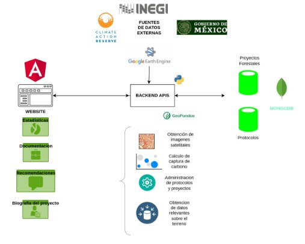

Equipo: T-error en tiempo de ejecución

Proyecto: Evaluación de elegibilidad para proyectos de carbono en territorios mexicanos y cálculo de la captura de carbono para la mejora del medio ambiente

Track: ITESO-PARIS 21 - Cálculo de Captura Carbono para mejorar el medio ambiente
# **Evaluación de elegibilidad para proyectos de carbono en territorios mexicanos y cálculo de la captura de carbono para la mejora del medio ambiente**

## Problemática a resolver
Actualmente, uno de los mayores desafíos que enfrenta el planeta es el cambio climático. El aumento de la concentración de los gases de efecto invernadero en la atmósfera es la principal causa del calentamiento global, y por lo tanto, del cambio climático.

Es por eso que es fundamental, desarrollar e implementar estrategias que como sociedad nos permitan detener e, incluso, contrarrestar el daño que hemos ocasionado a nuestro planeta.

Una excelente alternativa para mejorar las condiciones del medio ambiente a largo plazo son los proyectos de carbono, y la tecnología puede ser el coadyuvante perfecto para su correcta planeación y estimación.

Si bien, existen plataformas que permiten conocer la elegibilidad de la tierra para desarrollar un proyecto de carbono forestal, ninguna de estas se enfoca en el territorio mexicano, ni aplica el Protocolo Forestal para México del Climate Action Reserve. 

Nuestra plataforma digital permitirá a los usuarios estimar la elegibilidad de una tierra dentro del territorio mexicano, mediante el uso de una interfaz sencilla y amigable. La plataforma llevará al usuario a través de diferentes preguntas que proporcionan a un algoritmo los criterios ineludibles para considerar a una tierra elegible para desarrollar un proyecto de carbono. Una vez  completado el formulario, el usuario recibirá una resolución inmediata sobre la elegibilidad de su tierra y obtendrá recomendaciones específicas y personalizadas dependiendo de la ubicación, clima,  biomasa actual, uso de suelo y gobernanzas de la tierra evaluada, además de un cálculo estimado de la captura y almacenamiento de carbono si el proyecto se implementara.

Incluso si la tierra no es elegible para un proyecto, el usuario recibirá también los rubros específicos del Protocolo Forestal que no han sido satisfechos de acuerdo a la información proporcionada.

Impacto

Esta solución puede impactar directamente en la identificación de territorios mexicanos potencialmente candidatos para proyectos de carbono,  su estimación de captura de carbono correspondiente y permitirá un importante avance en el desarrollo de estadísticas ambientales exclusivas para México. En un futuro, si la solución tiene éxito, el proyecto podría impactar también en el mercado de bonos de carbono, lo que traería beneficios tanto para el medio ambiente, como para la economía mexicana. 

Nuestra plataforma está diseñada pensando específicamente en los siguientes tipos de usuarios, cualquier persona interesada en proyectos de carbono forestal y su impacto en el medio ambiente puede aprovechar sus beneficios:

- Autoridades y propietarios de terrenos que buscan cuidar, forestar o reforestar la tierra,y tomar una decisión informada acerca de si pueden o no iniciar un proyecto de carbono en el territorio del que son propietarios y contribuir así, a la disminución del calentamiento global.
- Compradores y potenciales vendedores de bonos de carbono, quienes lograrán tener la información necesaria para hacer proyecciones a futuro de la captura de carbono en terrenos viables y cómo eso afectaría el mercado de bonos para tomar mejores decisiones de inversión en proyectos de carbono.
- Científicos ambientales, quienes podrán consultar estadísticas, y si lo desean, hacer predicciones de territorios específicos
- Estadísticos ambientales, quienes contarán con una  herramienta de consulta centralizada que les permitirá obtener de un mismo lugar la información de regiones específicas delimitadas geográficamente

## ¿Cómo lo resolveremos?
## Flujos del cuestionario
## 
## Innovación y Creatividad
Nuestra solución funcionará con regiones más pequeñas que una entidad federativa, lo cual no se ha implementado aún en ninguna plataforma existente. Además es importante destacar, que sólo nuestra plataforma realizaría un proceso automatizado para determinar si la tierra que se está evaluando es elegible para un proyecto de carbono, de acuerdo con las datos proporcionados y hará cálculos suficientemente precisos sobre la captura de carbono que habrá como resultado de la implementación de dicho proceso.

Los usuarios de nuestra plataforma obtendrán un feedback personalizado independientemente de si su territorio es idóneo para un proyecto forestal o si no cumple con los requisitos suficientes todavía y obtendrán los puntos específicos que necesitan reforzar para poder empezar su proyecto de carbono sin la necesidad de leer las 200 páginas del Protocolo Forestal para México del Climate Action Reserve.

Asimismo, la plataforma arrojará información climatológica de la región donde se encuentra el territorio evaluado así como una recomendación del tipo de vegetación que podría ser cultivada sin desbalancear ni modificar el ecosistema de su región. Cabe mencionar que los datos geográficos específicos de la tierra, como la latitud y longitud se obtienen a través del código postal ingresado por el usuario, por lo tanto, es posible ubicar con facilidad el tipo de ecosistema específico del lugar según lo registrado por el INEGI en 2014.  Tomando como referencia el estudio de la biodiversidad mexicana de la CONABIO, la plataforma puede reconocer el tipo de vegetación específica para cada ecosistema y de esa manera, hacer una recomendación informada de la flora adecuada para el lugar. 

Finalmente, se le proporcionará al usuario un valor de referencia para que conozca que tanta captación de dióxido de carbono podría tener en su propiedad y si su ecosistema le permite alcanzar un nivel alto de captura. En todo momento el usuario recibirá orientación para que pueda sacar el mayor provecho a su proyecto forestal.
## Escalabilidad
Con este proyecto quedan abiertas varias posibilidades de implementar opciones que hagan de la plataforma y sus procesos una solución más robusta y aplicable a más escenarios. Nuestras propuestas son las siguientes:

- Permitir la opción de ingresar proyectos donde ya existen árboles adultos para calcular la captura de carbono a través de procesamiento de imágenes recolectadas de diferentes plataformas, como lo son las del INEGI y Google Earth. 
- Dar la opción al usuario de subir documentos con información catastral sobre el territorio y procesarlos con OCR para dar una respuesta mucho más precisa de si el terreno a evaluar es viable para realizar un proyecto de carbono. 
- Hacer cálculos a futuro donde nuestro usuario pueda elegir la fecha de inicio de su proyecto de carbono y proporcionar estimaciones de la captura de carbono que respondan al tipo de árbol plantado, su edad y la copa manglar que tendría en determinado tiempo.
- Hacer uso de Azure, un servicio en la nube, para concentrar la funcionalidad de la aplicación Web. Primero, desplegar la plataforma con App services. Luego, utilizar la base de datos, Azure Database Migration Service, para las posibles respuestas de feedback. Finalmente, Blob Storage para guardar los documentos que el usuario necesite subir.

## Viabilidad
Para que esta propuesta tenga éxito, es necesario que podamos obtener datos verídicos de los usuarios y que la información que se obtenga de diferentes recursos tecnológicos sea suficiente y útil para realizar los cálculos de captura de carbono. 

Además, es de vital importancia que la información que presentamos al usuario como respuesta se presente de manera simple, comprensible y llamativa y sobre todo, que esa información tenga un impacto en la motivación del usuario al utilizar nuestra plataforma. 

Finalmente, para tener mayor precisión en cuanto a la vegetación que se recomienda, consideramos importante acercarnos primero a meteorólogos para que nos apoyen con el desarrollo de una mejor clasificación de los climas y subclimas de México. Luego, apoyarnos de  biólogos expertos en la flora y fauna del país. De esa manera, tendremos una visión multidisciplinaria que nos permitirá dar mejor feedback en nuestra aplicación Web.
## Mérito técnico y uso de las tecnologías
Las tecnologías que decidimos usar para la implementación y desarrollo de esta plataforma son:

- La API zippopotam.us (https://api.zippopotam.us/MX/06050) se usará para encontrar el Código Postal y la colonia de la propiedad, así como las coordenadas decimales de latitud y longitud. (no decir)
- Python para el backend y la automatización del proceso de evaluación de la tierra y el cálculo de captura de carbono. Se utilizarán además algunas librerías como NumPy y Pandas para la manipulación de los datos. Y, para procesar los archivos SHP utilizaremos Geopandas 
- MongoDB para la base de datos, donde se podrán almacenar las posibles respuestas que recibirá el usuario como feedback.
- Angular para el desarrollo de UI, un framework que nos permitirá presentar al usuario una vista llamativa y una interacción amigable con la plataforma web.
- Además, utilizaremos otras herramientas para la obtención de los datos necesarios, tales como Google Earth Engine, los datos públicos del INEGI referentes a la vegetación (S6) y el Proyecto GEDI L4B de la NASA.
- Por último, se hará uso de la librería ShapeFile Javascript para la conversión de los archivos shape a un GeoJSON.
## 
### Fuentes consultadas
- [Tecnologías de captura y almacenamiento de dióxido de carbono](https://www.ecorfan.org/bolivia/researchjournals/Ciencias_Naturales_y_Agropecuarias/vol4num12/Revista_de_Ciencias_Naturales_y_Agropecuarias_V4_N12_4.pdf)
- [Demonstration of eligibility of lands for A/R CDM project activities](https://cdm.unfccc.int/methodologies/ARmethodologies/tools/ar-am-tool-19-v1.pdf)
- [Modalities and procedures for afforestation and reforestation project activities under the clean development mechanism in the first commitment period of the Kyoto Protocol](http://www.ciesin.columbia.edu/repository/entri/docs/cop/Kyoto_COP001_005.pdf)
- [LA CAPTACIÓN Y EL ALMACENAMIENTO DE DIÓXIDO DE CARBONO Grupo Intergubernamental de Expertos sobre el Cambio Climático](https://archive.ipcc.ch/pdf/special-reports/srccs/srccs_spm_ts_sp.pdf)
- [Protocolo Forestal para México](https://www.climateactionreserve.org/wp-content/uploads/2022/07/Mexico-Forest-Protocol-V3.0-Public-Comment-Draft_ESP.pdf)
- [Estimación de biomasa y captura de carbono forestal | Rocio Torres](https://www.youtube.com/watch?v=phsMJ691YnI)

